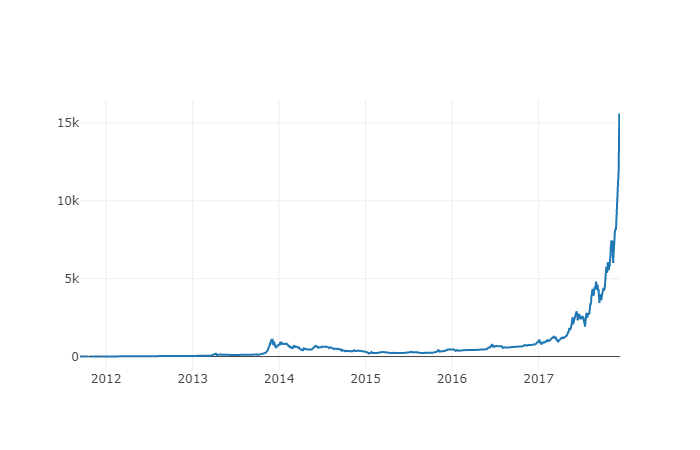
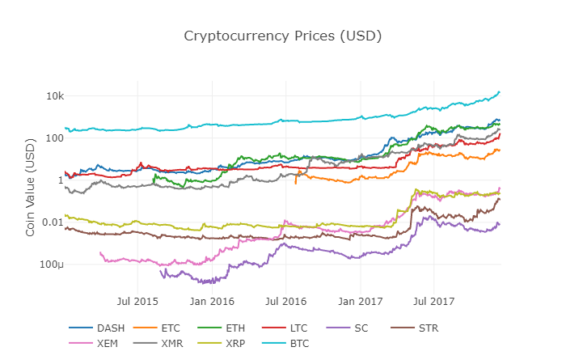
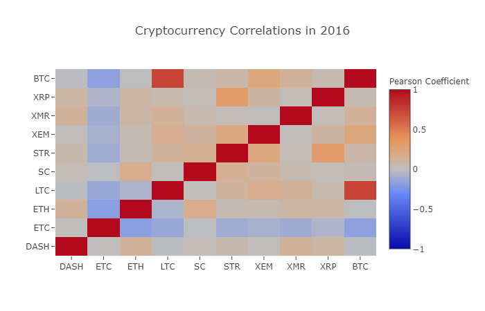
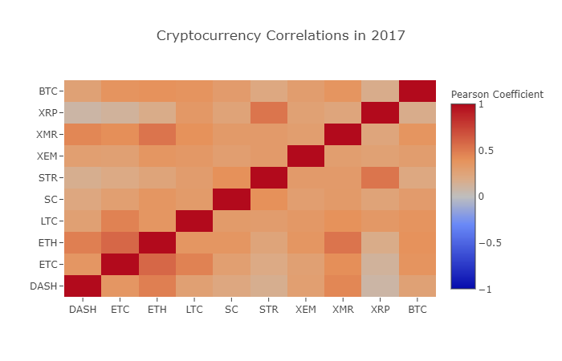
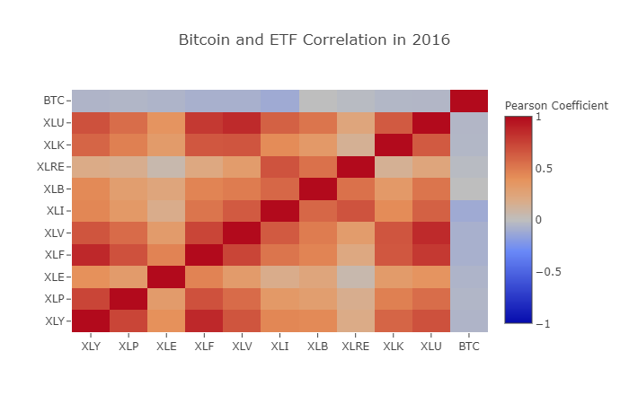
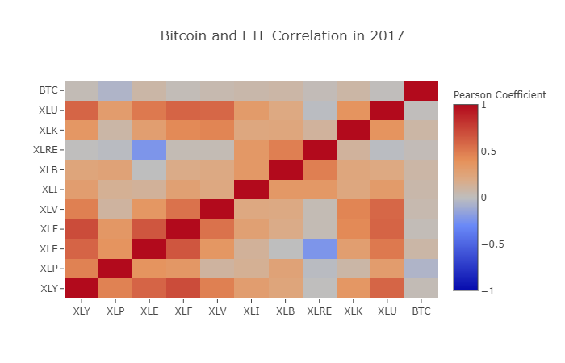
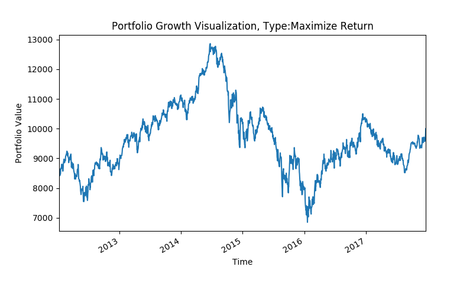
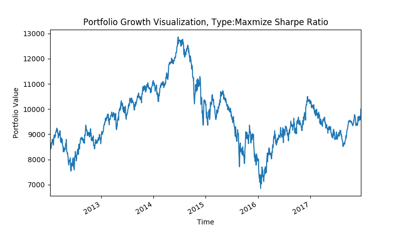
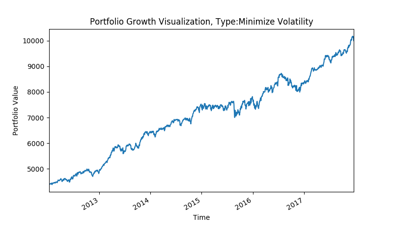
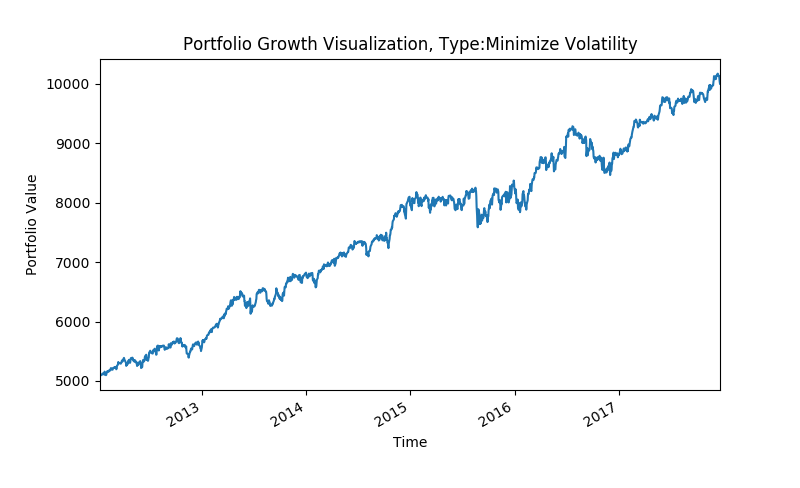

# Capstone -- How Bitcoin Will Improve our Asset Allocation Performance

## My Objective

I would like to research on how digital currencyc will impact the traditional asset allocation strategies.

## Step by Step Process
- Download data for Bitcoin, additional cryotocurrency, and 9 S&P 500 Sector ETFs
- Data cleaning and analysis on the 2 correlations (Bitcoin vs crytocurrency and Bitcoin vs S&P Sector ETFs)
- Determine if adding Bitcoin will add real value to the portfolio in theory
- Conduct analysis to approve the theory
- Sum up lessions learned

### My dataset

I downloaded data from both yahoo finance and quandl(see the code) for Bitcoin, 9 additional cryptocurrency, and 9 S&P 500 Sector ETFs. Stock price over years shown below

### Correlations

In 2016, Bitcoin has a low correlation with other crytocurrencies. However, this correlation signficantly increased in 2017. On the other hand, it seems like that Bitcoin has no correlation with S&P 500 sector ETFs for both 2016 and 2017.

### Bitcoin may improve our asset allocation ability

Since Bitcoin is nor correlated with our traditional sector ETFs, portfolio managers may benefit from Bitcoin investment as they can diversy risk

### Actual Performance

We will still use the most famous asset allocation method, "Mean-Variance Optimization"(MVO). And we still create three different portfolios with different goals: Maxmize Return, Minmize Volatility(Risk), and Maxmize Sharpe Ratio(Return/Risk).

#### Portfolio with goal to maxmize return

MVO did not allocate any weight to Bitcoin, therefore Bitcoin has no impact to the overall performance

#### Portfolio with goal to maxmize sharpe ratio

MVO did not allocate any weight to Bitcoin, therefore Bitcoin has no impact to the overall performance

#### Portfolio with goal to minmize volatilities

MVO did allocate some weight to Bitcoin, but there is no significant performance improvement

## What I learned
Apparently Bitcoin is not magical as we thought before we start this project as it contains huge risk. 
The traditional investment strategy is based on certain constrains and assumptions, which may not be able to capture all of its benefit.
However, as we can see in the correlation heatmap, cryptocurrencies are now being publicly traded by hedge fund and investment banks (Goldman is considering open a digital trading desk!)
The best strategy to trade digital currency needs more research.